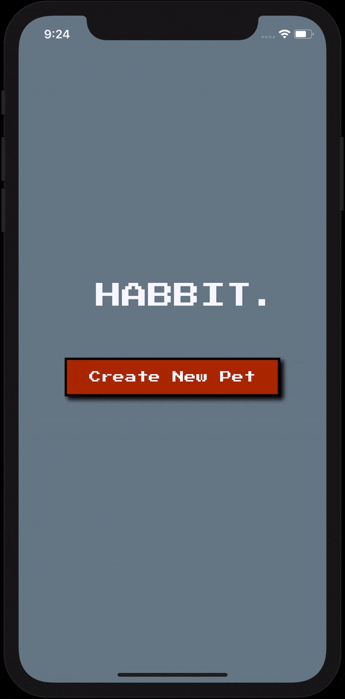

# Habbit

Habbit. is a mobile app, aimed to increase physical activity and build healthy habits.

## Setup

```
npm install
react-native link
```

```
cd ios
pod install
```

Navigate back to root folder

```
react-native run-ios
```

## Demo



### Technologies

React Native | JavaScript, SQLite

### Features

- User can name their pet

- Pet can grow based on user activity (step count)

- Progress bar that dynamically fills as more steps are added, and resets each growth stage

- User can interact with pet by tapping on it (animation and sound)

